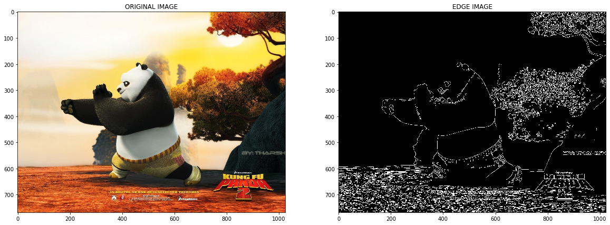
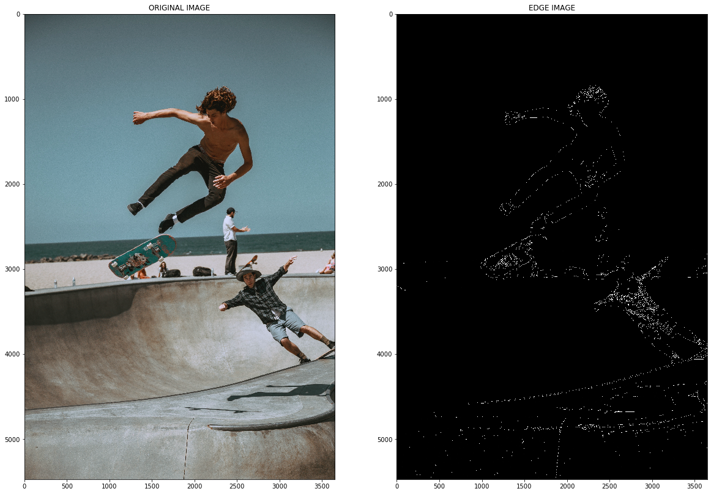

# Consuming my API

## Run `**python server.py**` on your terminal to start the server.


```python
%matplotlib inline
import jsonpickle
import requests
import matplotlib.pyplot as plt
import cv2
import numpy as np
```


```python
#prepare img for api
img = cv2.imread('./sample_imgs/img_1.jpg')
#encode image
_, img_encoded = cv2.imencode('.jpg', img)
#convert image to string
img_string = img_encoded.tostring()
#b, g, r = cv2.split(img)
new_img = cv2.cvtColor(img, cv2.COLOR_BGR2RGB)
```

## Prepare data for API
### Passing image to the API


```python
#you can either pass URL or an image file.
data = {'url':'', 'file':img_string}
data = jsonpickle.encode(data)
```


```python
api_url = 'http://localhost:8000/api/edge' #you can verify on your cli once you start the server
r = requests.post(api_url, data=data, headers={'content-type':'application/json'})
```


```python
#result from the api is of the form {'output':encoded_image}
new_data = r.text
new_data = jsonpickle.decode(new_data)
out_img = new_data['output']
nparr = np.frombuffer(out_img, np.uint8)
image = cv2.imdecode(nparr, cv2.IMREAD_COLOR)
```


```python
plt.figure(figsize=(20,20))
plt.subplot(121)
plt.imshow(new_img)
plt.title('ORIGINAL IMAGE')
plt.subplot(122)
plt.imshow(image)
plt.title("EDGE IMAGE")
```


    Text(0.5, 1.0, 'EDGE IMAGE')


    

    


## Passing URL to the API


```python
url = 'https://unsplash.com/photos/Yh2UPFrdYoU/download?force=true' #link gotten from unsplash.com
data = {'url':url, 'file':{}}
data = jsonpickle.encode(data)
```

## Send request


```python
r = requests.post(api_url, data=data, headers={'content-type':'application/json'})
```


```python
#result from the api is of the form {'output':encoded_image}
new_data = r.text
new_data = jsonpickle.decode(new_data)
out_img = new_data['output']
nparr = np.frombuffer(out_img, np.uint8)
image = cv2.imdecode(nparr, cv2.IMREAD_COLOR)
```


```python
original_img = cv2.VideoCapture(url)
retval, img = original_img.read()
img = cv2.cvtColor(img, cv2.COLOR_BGR2RGB)
```


```python
plt.figure(figsize=(20,20))
plt.subplot(121)
plt.imshow(img)
plt.title('ORIGINAL IMAGE')
plt.subplot(122)
plt.imshow(image)
plt.title("EDGE IMAGE")
```


    Text(0.5, 1.0, 'EDGE IMAGE')


    

    


```python

```
