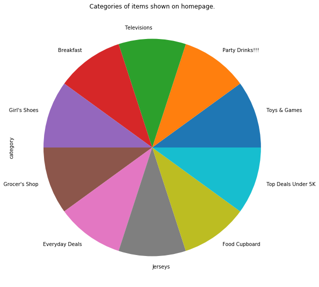
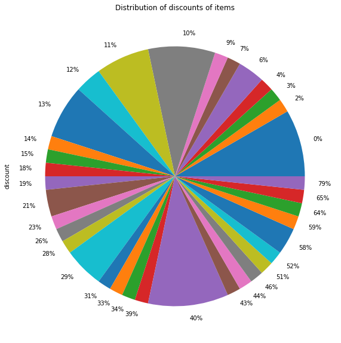
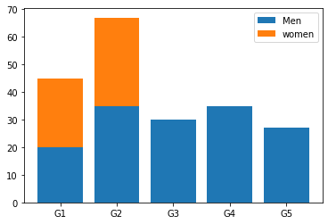
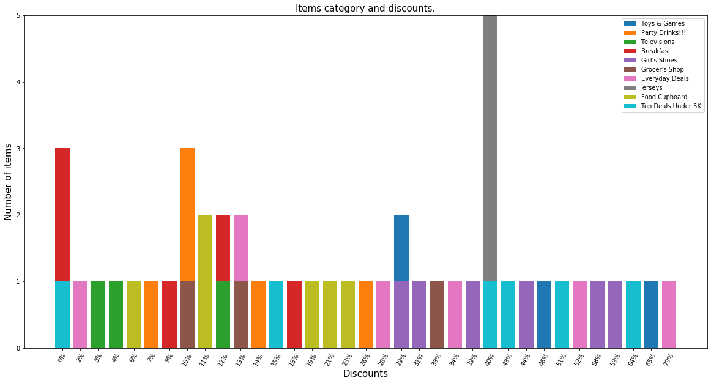

```python
%matplotlib inline
import pandas as pd
import matplotlib.pyplot as plt
```


```python
#load file
jumia = pd.read_csv("./jumia.csv", encoding="utf-16", na_values="?", index_col=False, quotechar="'")
jumia.tail(n=10)
```


<div>
<style scoped>
    .dataframe tbody tr th:only-of-type {
        vertical-align: middle;
    }

    .dataframe tbody tr th {
        vertical-align: top;
    }

    .dataframe thead th {
        text-align: right;
    }
</style>
<table border="1" class="dataframe">
  <thead>
    <tr style="text-align: right;">
      <th></th>
      <th>item</th>
      <th>price</th>
      <th>discount</th>
      <th>category</th>
    </tr>
  </thead>
  <tbody>
    <tr>
      <th>50</th>
      <td>LG LED Smart TV 43" inch LM6300 Series Full HD...</td>
      <td>₦ 171,490</td>
      <td>3%</td>
      <td>Televisions</td>
    </tr>
    <tr>
      <th>51</th>
      <td>Hisense 65" UHD 4k SMART LED TV +WIFI AND WALL...</td>
      <td>₦ 375,000</td>
      <td>13%</td>
      <td>Televisions</td>
    </tr>
    <tr>
      <th>52</th>
      <td>TCL 50-Inch 4k UHD Android Smart TV</td>
      <td>₦ 266,801</td>
      <td>12%</td>
      <td>Televisions</td>
    </tr>
    <tr>
      <th>53</th>
      <td>Hisense 55” A7100F UHD TV</td>
      <td>₦ 278,900</td>
      <td>NaN</td>
      <td>Televisions</td>
    </tr>
    <tr>
      <th>54</th>
      <td>Fashion Striped Runing Short Sleeve Outdoor Sp...</td>
      <td>₦ 7,750</td>
      <td>40%</td>
      <td>Jerseys</td>
    </tr>
    <tr>
      <th>55</th>
      <td>Adidas Arsenal Home Jersey</td>
      <td>₦ 8,500</td>
      <td>NaN</td>
      <td>Jerseys</td>
    </tr>
    <tr>
      <th>56</th>
      <td>Quick Dry Fashion Runing Short Sleeve Outdoor ...</td>
      <td>₦ 7,750</td>
      <td>40%</td>
      <td>Jerseys</td>
    </tr>
    <tr>
      <th>57</th>
      <td>Sports Gradient Stripe Short Sleeve Tshirt Men...</td>
      <td>₦ 6,750</td>
      <td>40%</td>
      <td>Jerseys</td>
    </tr>
    <tr>
      <th>58</th>
      <td>Sports Suit T-shirt Shorts Kids Men Women Socc...</td>
      <td>₦ 7,850</td>
      <td>40%</td>
      <td>Jerseys</td>
    </tr>
    <tr>
      <th>59</th>
      <td>Sports 3D Short Sleeve T-shirt Shorts Men Socc...</td>
      <td>₦ 8,350</td>
      <td>40%</td>
      <td>Jerseys</td>
    </tr>
  </tbody>
</table>
</div>


```python
cat = jumia['category'].value_counts()
cat.plot(kind="pie", figsize=(10,10));
plt.title("Categories of items shown on homepage.");
#plt.xlabel("Number of items");
```


    

    


## The number of items shown on homepage are same


```python
jumia.loc[jumia["discount"].isnull(), "discount"] = '0%'
```


```python
jumia.tail(n=10)
```


<div>
<style scoped>
    .dataframe tbody tr th:only-of-type {
        vertical-align: middle;
    }

    .dataframe tbody tr th {
        vertical-align: top;
    }

    .dataframe thead th {
        text-align: right;
    }
</style>
<table border="1" class="dataframe">
  <thead>
    <tr style="text-align: right;">
      <th></th>
      <th>item</th>
      <th>price</th>
      <th>discount</th>
      <th>category</th>
    </tr>
  </thead>
  <tbody>
    <tr>
      <th>50</th>
      <td>LG LED Smart TV 43" inch LM6300 Series Full HD...</td>
      <td>₦ 171,490</td>
      <td>3%</td>
      <td>Televisions</td>
    </tr>
    <tr>
      <th>51</th>
      <td>Hisense 65" UHD 4k SMART LED TV +WIFI AND WALL...</td>
      <td>₦ 375,000</td>
      <td>13%</td>
      <td>Televisions</td>
    </tr>
    <tr>
      <th>52</th>
      <td>TCL 50-Inch 4k UHD Android Smart TV</td>
      <td>₦ 266,801</td>
      <td>12%</td>
      <td>Televisions</td>
    </tr>
    <tr>
      <th>53</th>
      <td>Hisense 55” A7100F UHD TV</td>
      <td>₦ 278,900</td>
      <td>0%</td>
      <td>Televisions</td>
    </tr>
    <tr>
      <th>54</th>
      <td>Fashion Striped Runing Short Sleeve Outdoor Sp...</td>
      <td>₦ 7,750</td>
      <td>40%</td>
      <td>Jerseys</td>
    </tr>
    <tr>
      <th>55</th>
      <td>Adidas Arsenal Home Jersey</td>
      <td>₦ 8,500</td>
      <td>0%</td>
      <td>Jerseys</td>
    </tr>
    <tr>
      <th>56</th>
      <td>Quick Dry Fashion Runing Short Sleeve Outdoor ...</td>
      <td>₦ 7,750</td>
      <td>40%</td>
      <td>Jerseys</td>
    </tr>
    <tr>
      <th>57</th>
      <td>Sports Gradient Stripe Short Sleeve Tshirt Men...</td>
      <td>₦ 6,750</td>
      <td>40%</td>
      <td>Jerseys</td>
    </tr>
    <tr>
      <th>58</th>
      <td>Sports Suit T-shirt Shorts Kids Men Women Socc...</td>
      <td>₦ 7,850</td>
      <td>40%</td>
      <td>Jerseys</td>
    </tr>
    <tr>
      <th>59</th>
      <td>Sports 3D Short Sleeve T-shirt Shorts Men Socc...</td>
      <td>₦ 8,350</td>
      <td>40%</td>
      <td>Jerseys</td>
    </tr>
  </tbody>
</table>
</div>


```python
discount = jumia["discount"].value_counts()
discount = discount[sorted(discount.index, key=lambda x : int(x.strip('%')))]
discount.plot(kind="pie", figsize=(10,10));
plt.title("Distribution of discounts of items");
```


    

    


```python
labels = ['G1', 'G2', 'G3', 'G4', 'G5']
n = [20, 35, 30, 35, 27]
j = [25, 32, 0, 0, 0]
fig, ax = plt.subplots()
ax.bar(labels, n, label="Men")
ax.bar(labels, j, bottom=n, label="women")
ax.legend()
```


    <matplotlib.legend.Legend at 0x241e26b0ac8>


    

    


```python
category_names = cat.index
s = []
for c in category_names:
    j = jumia[jumia["category"]==c]
    l = []
    for d in discount.index:
        l.append(len(j[j["discount"]==d]))
        #if len(j[j["discount"]==d]):
        #    l.append(int(d.strip('%')))
        #else: l.append(0)
    s.append(l)
```


```python
category_names = cat.index
category_names
```


    Index(['Toys & Games', 'Party Drinks!!!', 'Televisions', 'Breakfast',
           'Girl's Shoes', 'Grocer's Shop', 'Everyday Deals', 'Jerseys',
           'Food Cupboard', 'Top Deals Under 5K'],
          dtype='object')


```python
j = jumia[jumia["category"]=='Toys & Games']
#j
len(j[j["discount"]=="29%"])
```


    2


```python
labels = cat.index
l = [f"D{i}" for i in range(1,len(discount.index)+1)]
fig, ax = plt.subplots(figsize=(20,10))
for i,arr in enumerate(s):
    if i==0: ax.bar(l, arr, label=labels[i])
    else: ax.bar(l, arr, bottom=s[i-1], label=labels[i])
ax.legend()
ax.set_xlabel("Discounts", fontsize=15)
ax.set_ylabel("Number of items", fontsize=15)
ax.set_xticklabels(discount.index, rotation=60);
ax.set_title("Items category and discounts.", fontsize=15);
```


    

    


```python

```
